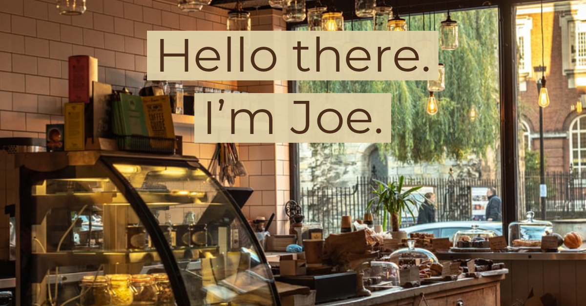

  

---

- 🔭 I’m currently working on: [Multiplex](https://github.com/jharrilim/Multiplex) - A pub/sub in-memory key-value store written in Rust.
- 🌱 I’m currently learning: Rust (I keep unlearning it due to not using it regularily)
- 👯 I’m looking to collaborate on: [cybil](https://github.com/jharrilim/cybil) - It turns out that writing the training function might be hard.
- 🤔 I’m looking for help with: [Multiplex](https://github.com/jharrilim/Multiplex) and [cybil](https://github.com/jharrilim/cybil)
- 💬 Ask me about: [TypeScript](https://github.com/microsoft/TypeScript), [React](https://github.com/facebook/react), or about [Node internals](https://github.com/nodejs/node)!
- ⚡ Fun fact: Chuck Norris doesn't do pushups, he pushes the world down.
